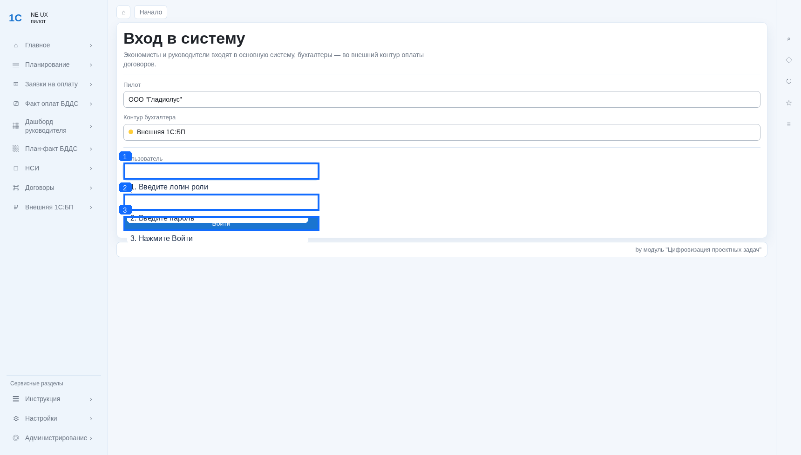
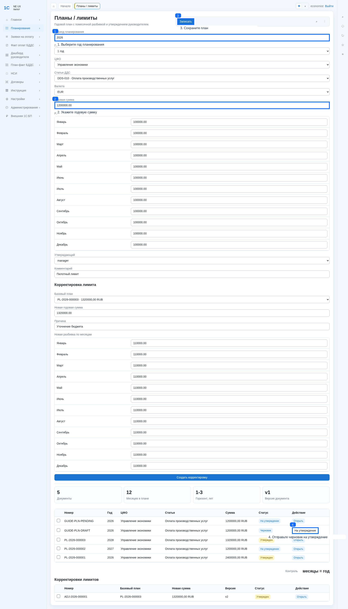
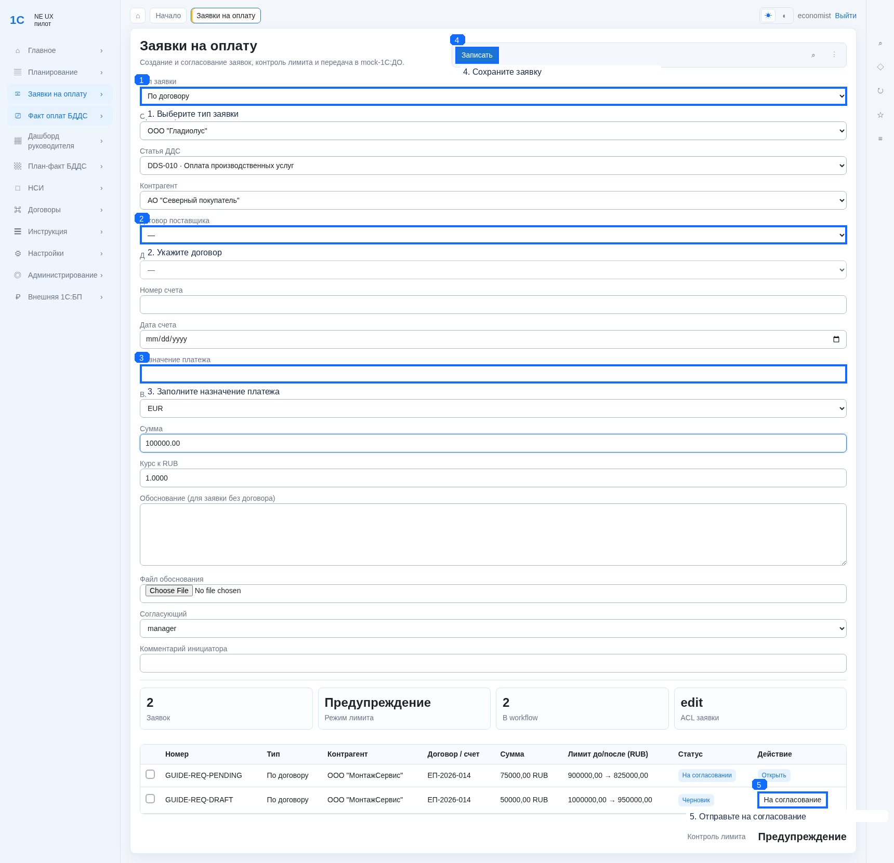
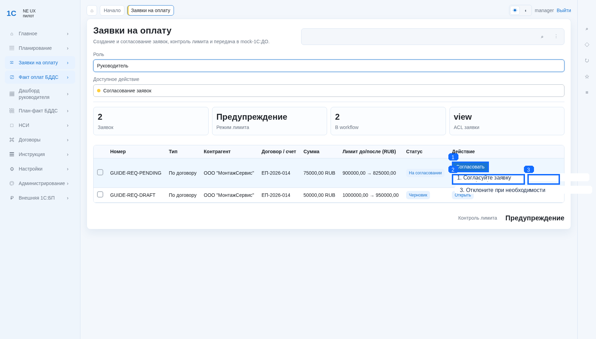
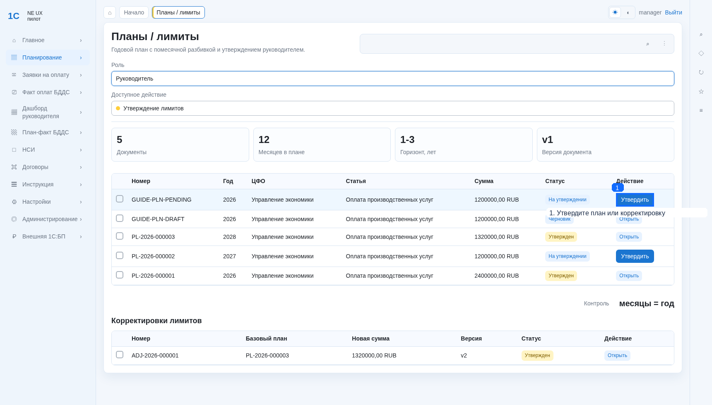
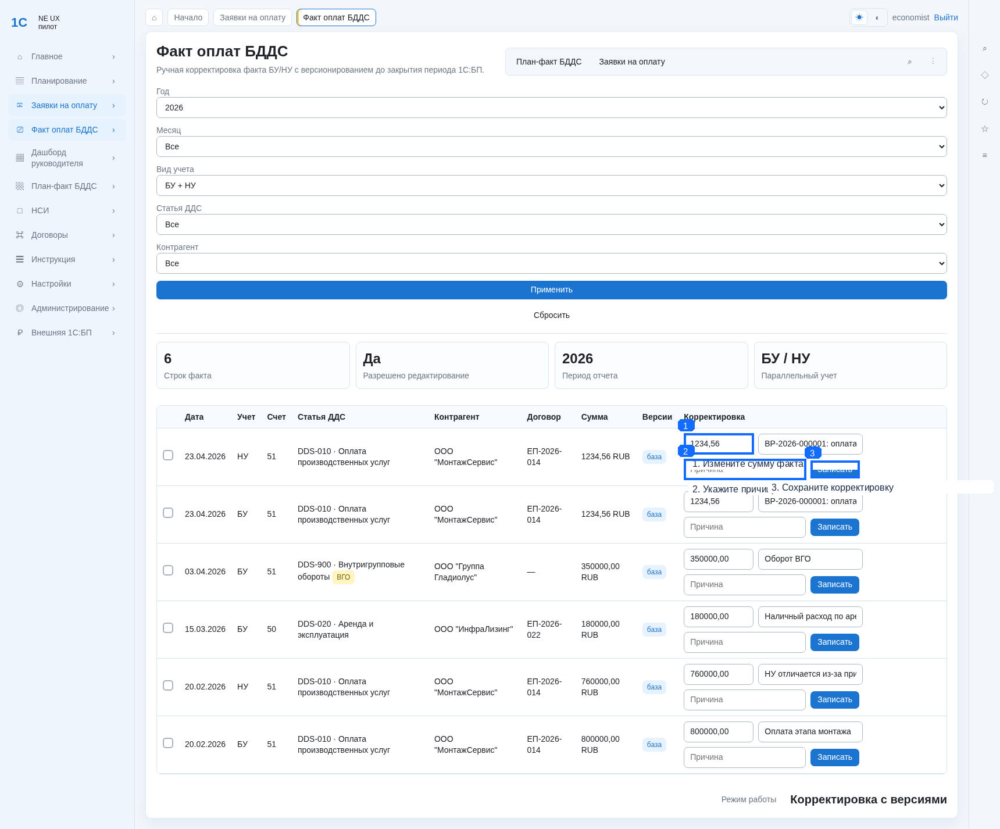
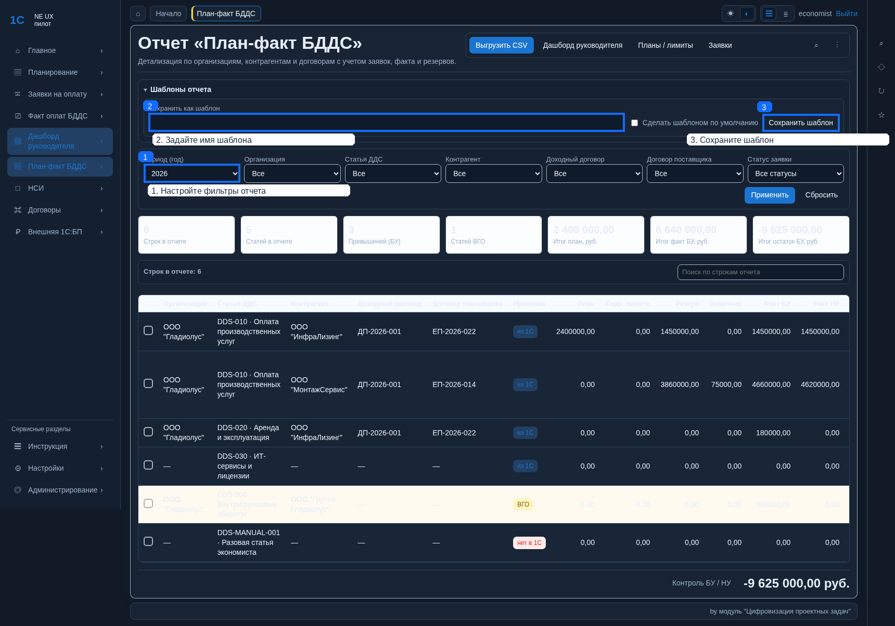
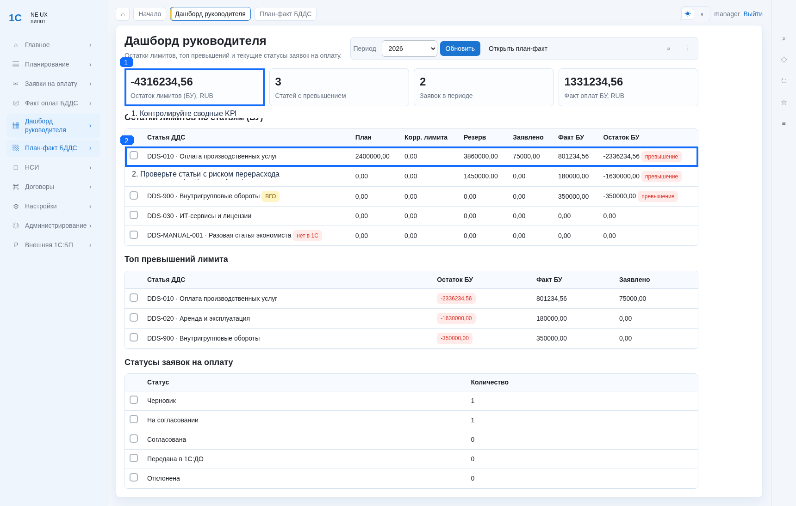
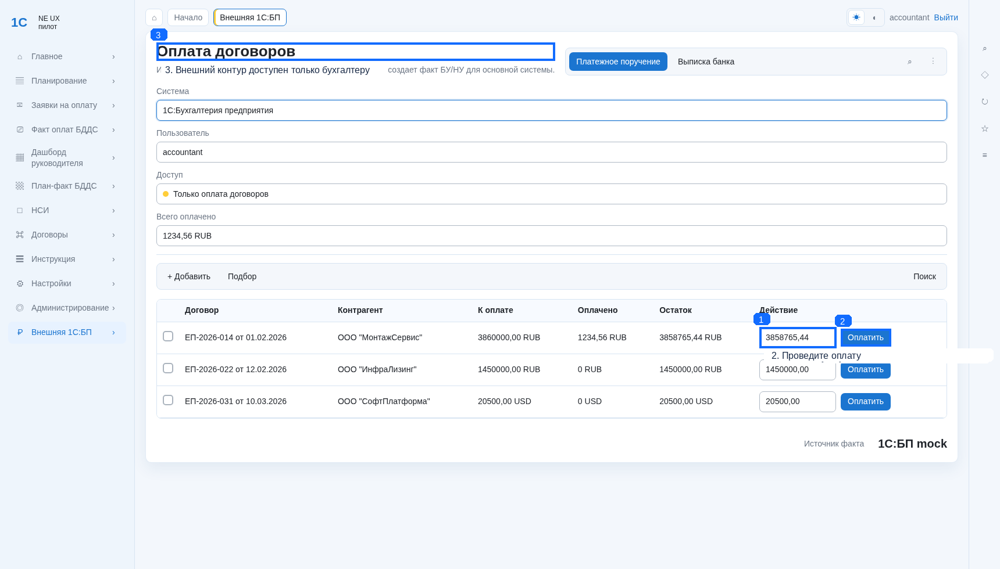
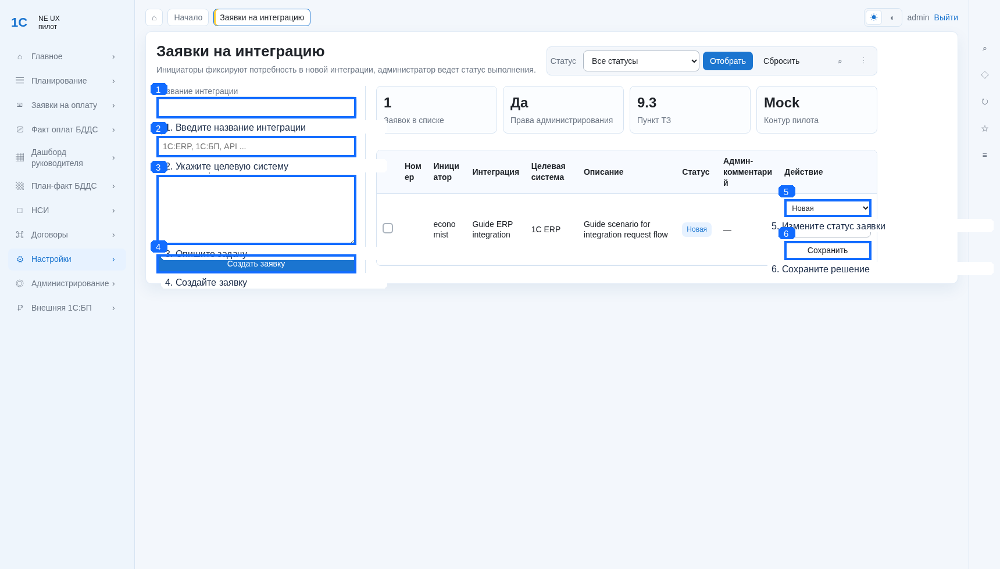

# NE UX

Система бюджетного контроля, работы с договорами и заявками на оплату для пилота ООО "Гладиолус".

Ключевая идея первой очереди: **имитация интеграции с 1С внутри системы** (Mock-1С), чтобы показать рабочий функционал и процессы до подключения реального обмена.

## 1. Что это за продукт

NE UX закрывает сквозной контур:

1. Планирование бюджетов: общий бюджет или распределение по ЦФО.
2. Назначение лимитов в рамках бюджета, с опциональной помесячной разбивкой.
3. Корректировки лимитов с версионированием.
3. Договоры и резервирование.
4. Заявки на оплату и согласование.
5. Факт оплат БУ/НУ.
6. План-факт аналитика и дашборд руководителя.
7. Внешний бухгалтерский контур (mock 1С:БП) для роли бухгалтера.

---

## 2. Визуализация продукта

Ниже экраны основных сценариев.

### Вход и роли


### Бюджеты и лимиты (экономист)


### Заявки на оплату (экономист)


### Согласование заявок (руководитель)


### Утверждение плана (руководитель)


### Корректировки факта БУ/НУ (экономист)


### План-факт и шаблоны отчётов


### Дашборд руководителя


### Внешний контур бухгалтера (mock)


### Заявки на интеграцию (администратор)


---

## 3. Роли и доступ

| Роль | Пользователь | Назначение |
|---|---|---|
| Администратор | `admin` | Полный доступ, админка, управление интеграционными заявками |
| Экономист | `economist` | Планирование, заявки, факт, отчётность, НСИ |
| Руководитель | `manager` | Согласование/утверждение, контроль в дашбордах |
| Бухгалтер | `accountant` | Только внешний контур оплат договоров |

Пароль демо-пользователей: `demo12345`.

---

## 4. Архитектура и имитация 1С

### 4.1. Принцип

- В системе есть доменная логика и интерфейсы, как будто обмен с 1С уже подключён.
- На первом этапе вместо реальной 1С используется **Mock-1С провайдер**.
- Это позволяет:
  - показывать конечный UX и бизнес-процессы;
  - не блокировать разработку до появления реальной интеграции;
  - позже заменить адаптер на реальный без переписывания основных экранов и сценариев.

### 4.2. Что имитируется

- загрузка НСИ;
- загрузка/обновление договоров;
- факт оплат БУ/НУ;
- передача заявок в mock 1С:ДО;
- внешний контур бухгалтера mock 1С:БП.

---

## 5. Основные разделы

- Рабочее место: `http://localhost:8000/`
- Бюджеты: `http://localhost:8000/planning/budgets/`
- Лимиты: `http://localhost:8000/planning/limits/`
- Заявки на оплату: `http://localhost:8000/payments/requests/`
- Факт оплат БДДС: `http://localhost:8000/payments/facts/`
- Договоры/резерв: `http://localhost:8000/contracts/reservations/`
- Дерево договоров: `http://localhost:8000/contracts/tree/`
- НСИ: `http://localhost:8000/nsi/`
- План-факт: `http://localhost:8000/reports/plan-fact/`
- Дашборд руководителя: `http://localhost:8000/reports/manager/`
- Внешняя 1С:БП (mock): `http://localhost:8000/external/accounting/`
- Уведомления: `http://localhost:8000/notifications/`
- Инструкция в интерфейсе: `http://localhost:8000/instruction/`
- Настройки интеграций: `http://localhost:8000/settings/integration-requests/`
- Журнал действий (админ): `http://localhost:8000/settings/audit/`
- Дизайн-система (админ): `http://localhost:8000/settings/styleguide/`
- Админка: `http://localhost:8000/admin/`
- Healthcheck: `http://localhost:8000/healthz/`

---

## 5а. Возможности рабочего контура

Сверх базового сквозного сценария реализованы операционные функции:

- **Уведомления.** Колокол в шапке с дропдауном последних событий и счётчиком
  непрочитанных, отдельная страница `/notifications/`. Сигналы шлются по
  ключевым событиям: заявка отправлена/согласована/отклонена/передана в 1С:ДО,
  лимит/бюджет на утверждении, лимит утверждён, превышение лимита, внешняя
  оплата проведена, изменение статуса интеграционной заявки.
- **Журнал действий (аудит).** Доступен администратору: фильтры по
  пользователю, действию, диапазону дат и полнотекстовый поиск, пагинация.
- **Массовые операции в журнале заявок.** Выделение строк чекбоксами и
  массовое «На согласование» / «Согласовать» / «Отклонить с комментарием» /
  «Передать в 1С:ДО» / «Отозвать свои». Кнопки активируются по однородности
  статусов выделенных строк.
- **Отмена заявки автором.** Черновик или заявку на согласовании автор может
  отозвать (статус «Отменена автором»); резерв лимита при этом освобождается.
- **Контроль SLA согласования.** Дата отправки фиксируется; на дашборде —
  карточка и вкладка «Просрочки» (по умолчанию > 3 дней), в журнале — значок
  ⏱ у зависших заявок. Команда `send_pending_sla_digest` рассылает
  согласующим сводку по cron.
- **Каскад корректировок.** Утверждение нового лимита или корректировки
  пересчитывает остаток/превышение у уже отправленных заявок по той же статье
  и компании и уведомляет участников при смене статуса превышения.
- **История версий.** Таймлайн корректировок для факта оплаты
  (`/payments/facts/<id>/history/`) и для лимита
  (`/planning/limits/<id>/history/`) с разницей «было → стало» и причинами.
- **Серверные фильтры и CSV-экспорт** журнала заявок: фильтр по статусу,
  «только превышения», полнотекстовый поиск; экспорт текущей выборки в CSV
  (UTF-8 BOM, разделитель `;` — для Excel).
- **Дизайн-система.** Единые токены (цвета/типографика/отступы/тени), светлая
  и тёмная темы, каталог компонентов на `/settings/styleguide/`.

---

## 6. Быстрый старт (Docker Compose)

```powershell
copy .env.example .env
docker compose up --build
```

Приложение: `http://localhost:8000`.

---

## 7. Подготовка демо-данных

### 7.1. Роли и пользователи

```powershell
docker compose exec web python manage.py setup_access_roles --with-users
```

### 7.2. Загрузка Mock-1С данных

```powershell
docker compose exec web python manage.py sync_mock_1c
```

Команда загружает/обновляет справочники, договоры, допсоглашения и факт оплат.

---

## 8. Проверка работоспособности

```powershell
docker compose exec web python manage.py check
docker compose exec web python manage.py check --deploy
docker compose exec web python manage.py test core
```

Тестовый набор `core` (127 тестов) покрывает RBAC и матрицу доступа, сквозные
сценарии заявок/лимитов/факта, prefill мастеров, уведомления и каскад,
массовые операции, отмену заявки, SLA, серверные фильтры и CSV-экспорт,
журнал аудита, security-guard'ы. Расширенный production/quality baseline
описан в `docs/QUALITY_AND_PRODUCTION.md`.

---

## 9. UX и интерфейс

- Общая логика интерфейса приближена к привычной модели 1С:
  - левое меню разделов;
  - табы сверху;
  - командные панели;
  - табличные части как центр рабочего сценария.
- Палитра бело-сине-голубая, тема переключается в шапке.
- Сайдбар фиксированный при скролле и разделён на:
  - рабочие разделы;
  - сервисные разделы (Инструкция, Настройки, Администрирование).
- Внизу приложения добавлен брендированный подвал:
  - `by модуль "Цифровизация проектных задач"`.

---

## 10. Git-процесс разработки

Рекомендуемая модель ветвления:

- `main` — стабильный релизный код;
- `develop` — интеграционная ветка;
- `feature/*` — изолированные итерации.

Правило итерации: каждый шаг должен быть завершённым и проверяемым (поднимается в Docker, есть сценарий проверки, есть коммит).

Если нужно подключить удалённый репозиторий:

```powershell
git remote add origin <repo-url>
git push -u origin main
git push -u origin develop
```

---

## 11. Где читать пользовательскую инструкцию

- В интерфейсе: `/instruction/`
- Исходник документа: `docs/user-guide/instruction.md`
- Иллюстрации: `docs/user-guide/images/annotated/`

---

## 12. Технологический стек

- Python / Django
- PostgreSQL
- Docker / Docker Compose
- HTML/CSS/JS (server-side templates)
- Role-based access (RBAC) на базе Django auth/groups + profile

### 12.1. Структура кода

- `core/views/` — пакет, разбитый по доменам: `auth`, `workspace`, `nsi`,
  `planning`, `payments`, `contracts`, `reports`, `external`, `integrations`,
  `workflow` (универсальный wizard действий над документом), `audit`,
  `notifications`, `instruction`. Общие хелперы — в `_shared` и
  `_permissions`; публичный API собирается в `core/views/__init__.py`.
- `core/services/` — бизнес-логика (бюджеты, лимиты, заявки, факт, договоры,
  отчёты, уведомления, внешний контур, синхронизация Mock-1С).
- `core/static/css/app.css` — единая таблица стилей и дизайн-система
  (вынесена из инлайна; кешируется браузером).

### 12.2. Production-настройки и guard'ы

При `DJANGO_DEBUG=0` приложение откажется стартовать с небезопасным
`SECRET_KEY` (короткий/плейсхолдер) или пустым/`*` `ALLOWED_HOSTS`; команда
`setup_access_roles --with-users` отклонит дефолтный пароль `demo12345`
(см. `.env.example`). Опциональный антивирус-скан файлов обоснования
подключается через `NE_UX_AV_SCANNER` (dotted-path к callable).
